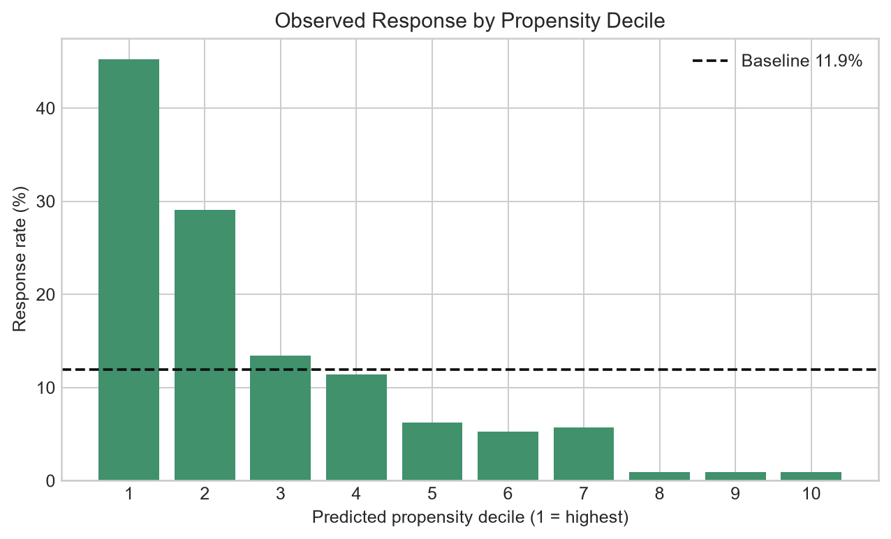
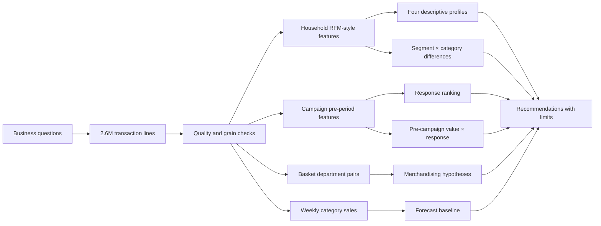
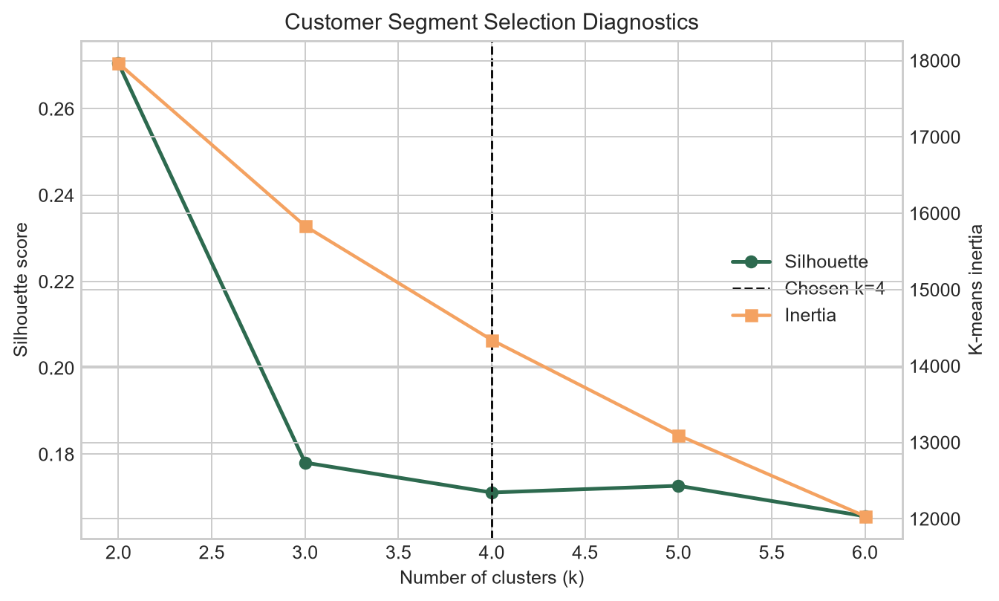
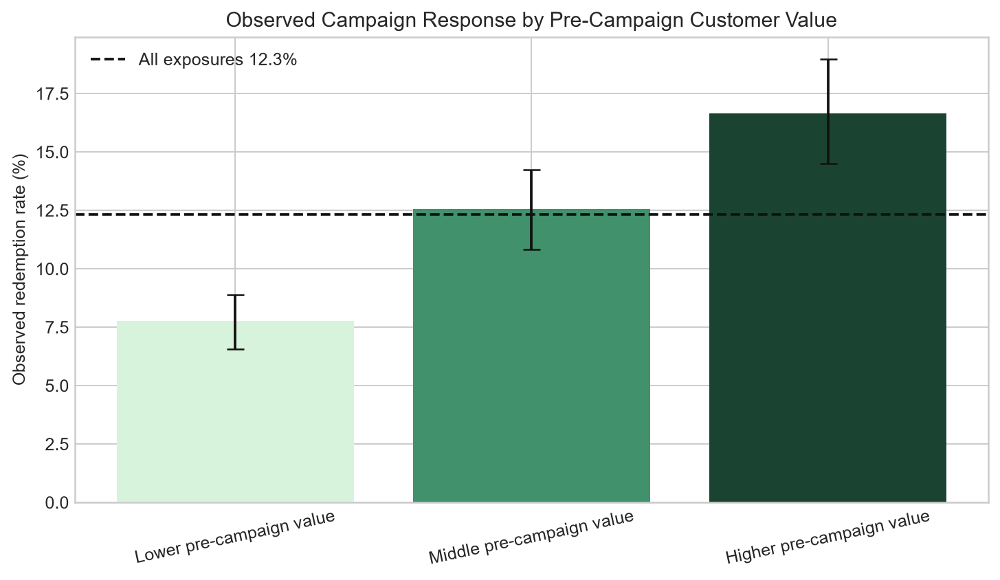
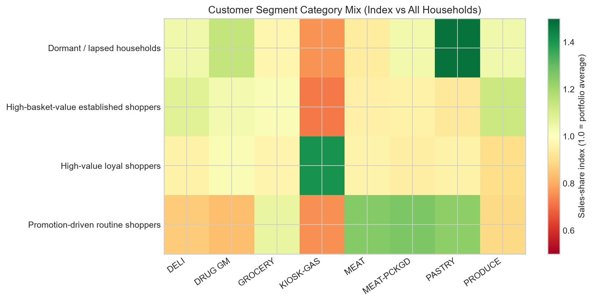

# Retail Decision Analytics

**Business problem:** decide which households to prioritize, how value and category behavior differ, which category pairings to test, and which demand baseline to use.
**Data:** 2,595,732 line-item transactions, 276,484 baskets, 2,500 anonymous households, 102 weeks.  
**Method:** grain-checked RFM-style features, scaled K-means diagnostics, household-grouped response modeling, pre-campaign value profiling, segment/category indices, basket rules, and an eight-week forecast benchmark.
**Result:** **0.826 ROC-AUC** and **3.79× top-decile observed-response lift**; higher pre-campaign value exposures showed **16.65% observed response** versus **7.78%** for the lower tier; Seasonal Naive led forecasting at **9.30% WAPE**.



## Decision story



## Data definitions and grain

- **Transaction grain:** one product line within a basket. Exact duplicate lines: **0**.
- **Basket grain:** unique `basket_id`; frequency is the count of distinct baskets, not line items.
- **Household grain:** one row per anonymous `household_key` for segmentation.
- **Monetary:** sum of positive `sales_value`; **Recency:** final valid dataset day minus household’s last positive-purchase day; **Frequency:** distinct positive-purchase baskets.
- 14,466 non-positive-quantity and 18,850 non-positive-sales rows are recorded in quality results and excluded from positive-purchase features.

## Customer profiles

K-means is used because the goal is a compact, distance-based descriptive vocabulary over continuous behavior. Skewed activity/value variables receive `log1p`; all clustering variables are standardized. Both inertia and silhouette are exported for k=2…6.

| Profile | Households | Mean recency | Mean sales | Mean baskets | Evidence-based use |
|---|---:|---:|---:|---:|---|
| High-value loyal | 440 | 4.7 days | 7,271 | 292.6 | Protect service and availability; do not default to blanket discounts. |
| High-basket-value established | 881 | 11.3 days | 3,939 | 95.1 | Emphasize range and basket-building tests. |
| Promotion-driven routine | 670 | 17.0 days | 1,712 | 77.5 | Test offer efficiency and margin-aware targeting. |
| Dormant / lapsed | 509 | 79.5 days | 473 | 21.9 | Use low-cost reactivation experiments or suppress contact. |

k=4 has silhouette **0.171**, while k=2 is the numerical winner at **0.271**. k=4 is retained only because it yields four distinguishable business profiles; it is not claimed as a natural ground-truth taxonomy. Stability is high across seeds (minimum adjusted Rand index **0.962**) and remains **0.943** after 1st/99th-percentile winsorization sensitivity.



## Campaign validation

Entire households—not rows—are held out. The Random Forest test covers 2,096 campaign exposures from 476 unseen households: ROC-AUC 0.826, PR-AUC 0.428, Brier 0.099, precision 0.445, recall 0.392, and F1 0.417. At a test baseline response rate of 11.93%, the highest score decile responded at 45.24% (3.79× lift); the top 20% captured 62.4% of responders.

This is **observed redemption ranking**, not causal uplift. A randomized no-contact/business-as-usual group is required before claiming incremental response or financial impact.

## Pre-campaign customer value × observed response

For every campaign exposure, the pipeline creates a value score from sales rate, basket rate, and inverse recency measured strictly before campaign start. Exposure-specific terciles show an ordered descriptive pattern: **7.78%** response for the lower tier, **12.57%** for the middle tier, and **16.65%** for the higher tier, versus **12.33%** overall. The higher-tier 95% interval is **14.50%–18.97%**; intervals use 500 household-cluster bootstrap replicates so repeated exposures stay together.



This is customer value profiling, not promotion uplift. Tier assignment is observational and campaign mix may differ across tiers.

## Segment × category differences

The four retrospective customer profiles have different category mixes. Under a minimum of 1,000 segment baskets and 1% overall sales share, the strongest over-indexed departments are PASTRY for dormant/lapsed households (**1.47×**), NUTRITION for high-basket-value established shoppers (**1.41×**), KIOSK-GAS for high-value loyal shoppers (**1.41×**), and MEAT-PCKGD for promotion-driven routine shoppers (**1.26×**). These indices support assortment or merchandising hypotheses; they do not establish incremental sales.



## Basket analysis

The strongest exported department pair was MEAT with SEAFOOD-PCKGD: support **1.63%** (4,494 baskets), lift **2.62**. Direction matters: MEAT → seafood confidence is only **8.43%**, while seafood → MEAT is **50.80%**. The responsible recommendation is an A/B merchandising hypothesis—not a claim that pairing will increase sales.

## Forecast benchmark

Five high-sales commodities, three methods, one chronological eight-week holdout. Seasonal Naive achieved the best aggregate WAPE at **9.30%**, versus Random Forest 12.19% and four-week Moving Average 12.71%. The honest conclusion is that complexity did not earn adoption in this test.

## Reproduce

```bash
python -m venv .venv
.venv/Scripts/pip install -r requirements.txt
.venv/Scripts/python src/pipeline.py --data-dir "PATH/TO/DUNNHUMBY_CSV" --output-dir .
```

Expected input files are listed in `src/pipeline.py`. Raw data are not redistributed; see [DATA_NOTE.md](DATA_NOTE.md). Canonical rerun facts are in `results/headline_metrics.json`.

## Limitations

One retailer-like academic dataset; retrospective descriptive clusters; response rather than incrementality; observational value/category differences; one forecast origin; only five forecasted commodities. No deployment, revenue gain, cost saving, or realized customer impact is claimed.
